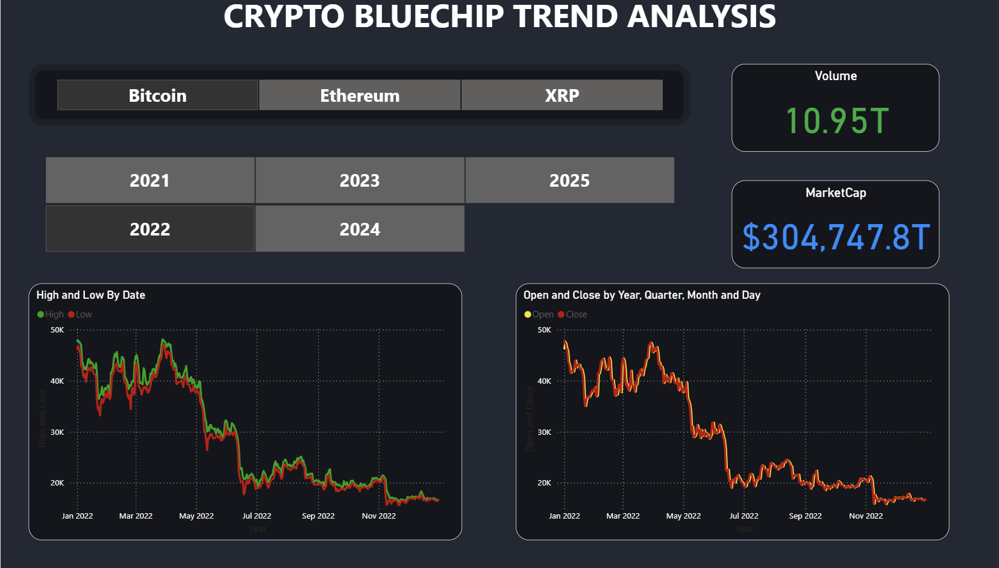
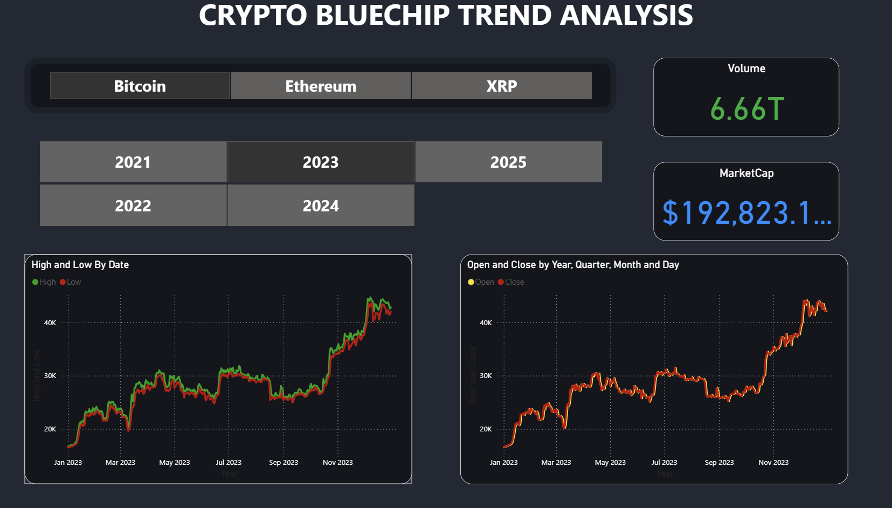
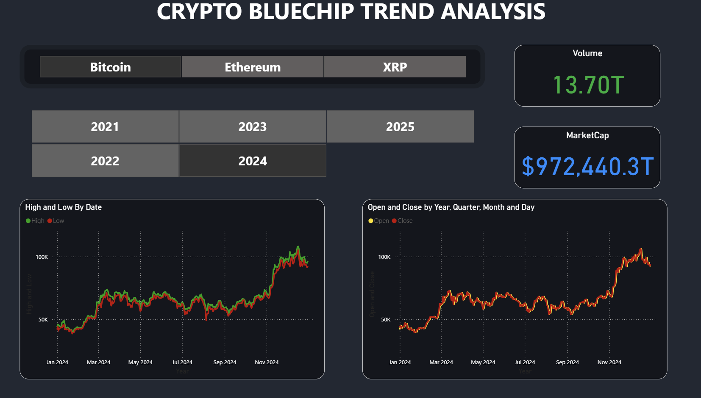
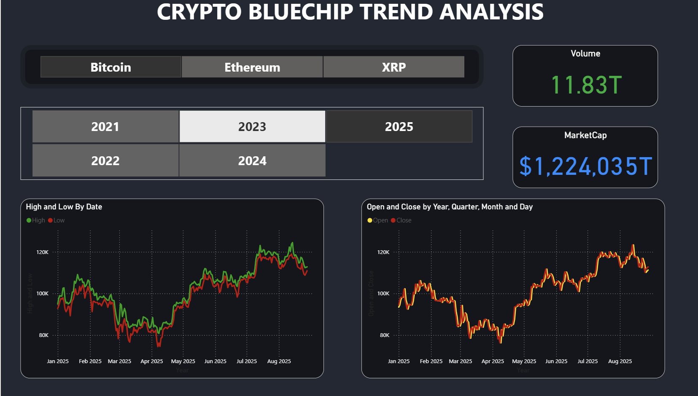
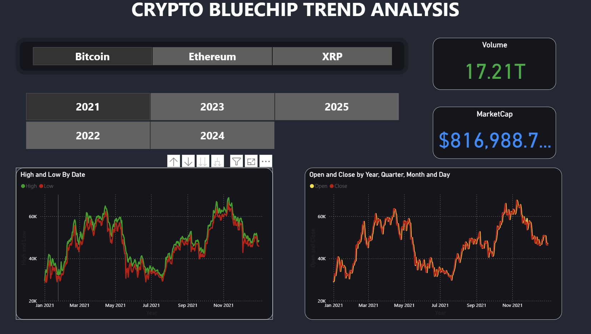

# 📊 Bitcoin Market Cycle Analysis – Insights & Business Recommendations

## 🔄 Executive Summary
Bitcoin historically follows a **4-year market cycle** tied to its **halving events**. Each cycle displays similar phases:  
- **Year 1 (post-halving):** Gradual bullish momentum (e.g., 2020, 2024).  
- **Year 2:** Peak bull run, high volume, retail euphoria (e.g., 2013, 2017, 2021, projected 2025).  
- **Year 3:** Sharp bear market, corrections of 70–85% from ATH (e.g., 2014, 2018, 2022, projected 2026).  
- **Year 4:** Consolidation/accumulation, sideways price action (e.g., 2015, 2019, 2023, projected 2027).  

**Key insight:** The cyclical nature of BTC offers both trading strategies and clear business opportunities for exchanges, trading platforms, and data providers.  

---

## 📈 Market Insights
1. **Volatility & Volume**
   - High volatility during bull peaks (2021, projected 2025).  
   - Volume spikes align with significant rallies → momentum-driven market.  
   - Market cap growth confirms institutional participation.  

2. **Liquidity & Participation**
   - Narrower spreads and deeper liquidity in later cycles → institutional-grade market.  
   - Retail joins during euphoria, while institutions accumulate during bear and consolidation phases.  

3. **Cycle Predictability**
   - Traders and businesses can align strategies with predictable phases: accumulation → bull → bear → consolidation.  

---

## 💡 Business Recommendations

### Bull Market (2024–2025)
- **Retail Products:** Automated DCA, margin & derivatives with built-in risk controls, educational campaigns.  
- **Institutional Services:** Custody, prime brokerage, real-time analytics APIs.  
- **Strategy:** Maximize user acquisition, incentivize liquidity providers.  
- **Monetization:** Premium signals (on-chain, momentum), subscription-based market research.  

### Bear Market (2026–2027)
- **Retail Products:** Principal-protected structured notes, risk management features.  
- **Institutional Services:** Hedging tools (futures, options), advanced API data feeds.  
- **Strategy:** Focus on retention, reduce churn, pivot revenue toward data/analytics services.  

### Accumulation Phase (2027–2028, pre-halving)
- **Retail Products:** Auto-rebalancing portfolios, scheduled DCA tools.  
- **Institutional Services:** Onboarding packages (custody + SLA + compliance).  
- **Strategy:** Build loyal user base at low cost, prepare for next bull cycle.  

---

## 📊 KPIs to Monitor
- **Daily:** Trading volume, funding rates, bid-ask spreads, realized volatility.  
- **Weekly:** Exchange inflows/outflows, DAU/MAU, premium product conversion rate.  
- **Monthly/Quarterly:** AUM of investment products, churn rate, P&L of market-making desk, institutional volume share.  

---

## 🚀 90-Day Action Plan
1. **Weeks 1–2:** Implement risk alerts (funding rate, volume spikes), deploy DCA templates.  
2. **Weeks 3–6:** Launch educational campaign on DCA & leverage risks, run A/B tests on landing pages.  
3. **Months 2–3:** Release MVP for premium analytics (moving averages, RSI, on-chain flows); outline roadmap for structured notes.  
4. **Month 3:** Review KPIs, adjust liquidity incentives, refine go-to-market strategy.  

---

## 🧭 Trader & Business Alignment
- **Traders:** Use cycle patterns for positioning (long bias during bull, hedging in bear, DCA in accumulation).  
- **Businesses:** Align product roadmap with market cycles → maximize growth in bull, retain and monetize data in bear, prepare infrastructure in accumulation.  

---

## 📌 Conclusion
The 4-year Bitcoin cycle provides **predictable patterns** that can be leveraged not only for trading strategies but also for long-term business planning. Platforms that adapt their products and services according to each market phase can optimize revenue, manage risks, and build sustainable growth.  
